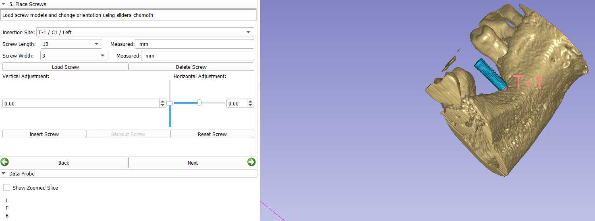
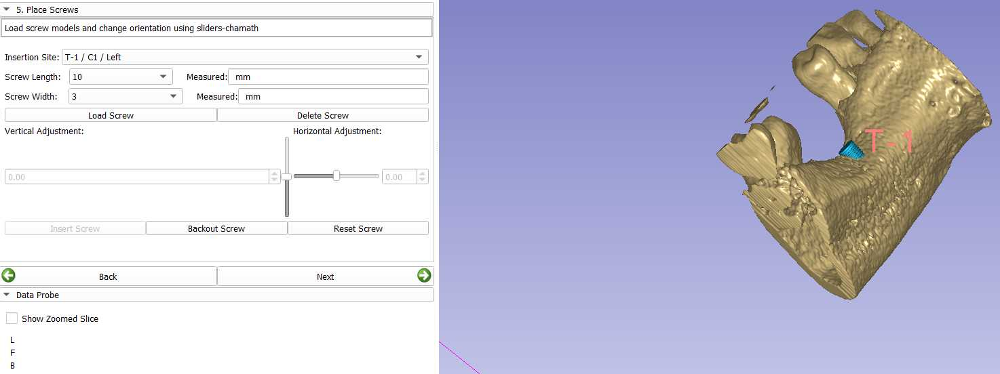

# SlicerImplant
Dental Implant planning, training, simulation and research extension for 3D Slicer.

Acknowledgment

testtibng one 

This work is inspired by the 3D Slicer module for pedicle screw insertion
training found at  https://github.com/lassoan/PedicleScrewSimulator.git
